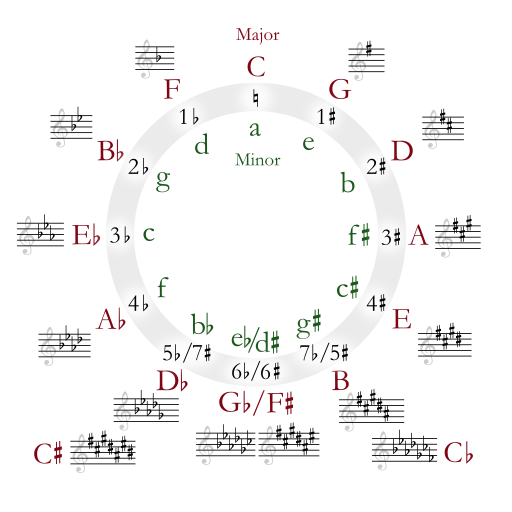

# Machine Learning Engineer Nanodegree
## Capstone Project - Audio key estimation of digital music with CNNs
Daniel Hellwig
August 20th, 2018

## I. Definition

### Project Overview
The art of mixing recorded music in real time is known as DJing and performed by a Disc Jockey (DJ). DJs use specialized equipment that can play at least two sources of recorded music simultaneously to create smooth transitions from one song to another [2].

The way of how the transitions are made became extremely versatile nowadays. Hereby one DJ technique experienced a renaissance in 2006: harmonic mixing. The goal of harmonic mixing is to transition between songs of the same or related key, notes of a certain scale that form the basis of a piece of music. This technique enables a DJ to make smooth continuous mixes and prevents unstable tone combinations, known as dissonance [3].

This project deals with the learning task to estimate audio keys of digital music. A mulitclass classifier is trained using samples of digital music files. The Million Song Dataset (MSD) [8] is utilized to select appropriate songs and includes information about their tonic note and mode as well as how confident both are. The learning task is limited to diatonic scales, typically used in western music.

### Problem Statement
The task is to estimate the audio key of a digital 30 second sample of a western music piece.

The task includes:
- Data Retrieval
  - retrieve the Million Song Dataset and select appropriate songs
  - create a dataset of selected songs
- Data Preprocessing
  - perform preparatory signal processing tasks
  - extract features of the song dataset, output is spectrogram images
  - create a dataset of song spectrograms
- Model Preparation/Training
  - preprocess the spectrograms
  - build and train a convolutional neural network multiclass classifier
- Model Evaluation/Comparison
  - evaluate the classifier with certain metrics
  - benchmark the classifier against another key estimation software with the help of the MIREX evaluation procedure

The resulting classifier can be used to determine the key of western music pieces.

### Metrics
The used metric depends on the following question: Out of all estimated keys for given music pieces, how many were classified correctly? This can be calculated by the accuracy for binary classification problems.

Since the songs within each key class are going to be unbalanced due to a high variety of patterns in the spectrograms, it is better to use the F-beta score with beta=1 instead:
<pre>
             Prec * Rec
F_1 = 2 * -----------------
             Prec + Rec
</pre>
with Prec = Precision, Rec = Recall.

For the comparison to another key estimation software, a second metric named MIREX evaluation procedure is used (src: http://music-ir.org/mirex/wiki/2005:Audio_and_Symbolic_Key_Finding#Evaluation_Procedures). The metric compares the identified key by the algorithm against the actual key of the piece and gives points dependent on their relationship:
<pre>
relation to correct key points:
same                       1.0
distance of perfect fifth  0.5
relative major/minor       0.3
parallel major/minor       0.2 
</pre>
The distance of perfect fifth can be either the dominant (fifth) or subdominant (fourth) from the tonic note of the actual key.

The circle of fifths is shown below to better understand how the evaluation works:

(circle of fifths)
attribution: By Just plain Bill [GFDL (http://www.gnu.org/copyleft/fdl.html) or CC-BY-SA-3.0 (http://creativecommons.org/licenses/by-sa/3.0/)], from Wikimedia Commons

Example: A music piece may have the actual key C major. The dominant is G major, the subdominant is F major. The relative key is A minor. The parallel key is C minor.

## II. Analysis
_(approx. 2-4 pages)_

### Data Exploration
The feature dataset used for the classifier holds spectrogram images of 30 second song samples. The songs itself are selected beforehand with the help of the Million Song Dataset.

The Million Song Dataset is a collection of audio features and metadata for a million popular songs (src: https://labrosa.ee.columbia.edu/millionsong/), but it does not contain the songs itself. This datset is utilized to select appropriate songs which have a key an mode confidence of at least 75%. Two additional files which come along with the MSD are from interest: a summary file with song metadata of the whole dataset (http://labrosa.ee.columbia.edu/millionsong/sites/default/files/AdditionalFiles/msd_summary_file.h5) and a track file with all songs and their unique IDs (http://labrosa.ee.columbia.edu/millionsong/sites/default/files/AdditionalFiles/unique_tracks.txt).

In this section, you will be expected to analyze the data you are using for the problem. This data can either be in the form of a dataset (or datasets), input data (or input files), or even an environment. The type of data should be thoroughly described and, if possible, have basic statistics and information presented (such as discussion of input features or defining characteristics about the input or environment). Any abnormalities or interesting qualities about the data that may need to be addressed have been identified (such as features that need to be transformed or the possibility of outliers). Questions to ask yourself when writing this section:
- _If a dataset is present for this problem, have you thoroughly discussed certain features about the dataset? Has a data sample been provided to the reader?_
- _If a dataset is present for this problem, are statistics about the dataset calculated and reported? Have any relevant results from this calculation been discussed?_
- _If a dataset is **not** present for this problem, has discussion been made about the input space or input data for your problem?_
- _Are there any abnormalities or characteristics about the input space or dataset that need to be addressed? (categorical variables, missing values, outliers, etc.)_

### Exploratory Visualization
In this section, you will need to provide some form of visualization that summarizes or extracts a relevant characteristic or feature about the data. The visualization should adequately support the data being used. Discuss why this visualization was chosen and how it is relevant. Questions to ask yourself when writing this section:
- _Have you visualized a relevant characteristic or feature about the dataset or input data?_
- _Is the visualization thoroughly analyzed and discussed?_
- _If a plot is provided, are the axes, title, and datum clearly defined?_

### Algorithms and Techniques
In this section, you will need to discuss the algorithms and techniques you intend to use for solving the problem. You should justify the use of each one based on the characteristics of the problem and the problem domain. Questions to ask yourself when writing this section:
- _Are the algorithms you will use, including any default variables/parameters in the project clearly defined?_
- _Are the techniques to be used thoroughly discussed and justified?_
- _Is it made clear how the input data or datasets will be handled by the algorithms and techniques chosen?_

### Benchmark
In this section, you will need to provide a clearly defined benchmark result or threshold for comparing across performances obtained by your solution. The reasoning behind the benchmark (in the case where it is not an established result) should be discussed. Questions to ask yourself when writing this section:
- _Has some result or value been provided that acts as a benchmark for measuring performance?_
- _Is it clear how this result or value was obtained (whether by data or by hypothesis)?_

## III. Methodology
_(approx. 3-5 pages)_

### Data Preprocessing
In this section, all of your preprocessing steps will need to be clearly documented, if any were necessary. From the previous section, any of the abnormalities or characteristics that you identified about the dataset will be addressed and corrected here. Questions to ask yourself when writing this section:
- _If the algorithms chosen require preprocessing steps like feature selection or feature transformations, have they been properly documented?_
- _Based on the **Data Exploration** section, if there were abnormalities or characteristics that needed to be addressed, have they been properly corrected?_
- _If no preprocessing is needed, has it been made clear why?_

### Implementation
In this section, the process for which metrics, algorithms, and techniques that you implemented for the given data will need to be clearly documented. It should be abundantly clear how the implementation was carried out, and discussion should be made regarding any complications that occurred during this process. Questions to ask yourself when writing this section:
- _Is it made clear how the algorithms and techniques were implemented with the given datasets or input data?_
- _Were there any complications with the original metrics or techniques that required changing prior to acquiring a solution?_
- _Was there any part of the coding process (e.g., writing complicated functions) that should be documented?_

### Refinement
In this section, you will need to discuss the process of improvement you made upon the algorithms and techniques you used in your implementation. For example, adjusting parameters for certain models to acquire improved solutions would fall under the refinement category. Your initial and final solutions should be reported, as well as any significant intermediate results as necessary. Questions to ask yourself when writing this section:
- _Has an initial solution been found and clearly reported?_
- _Is the process of improvement clearly documented, such as what techniques were used?_
- _Are intermediate and final solutions clearly reported as the process is improved?_

## IV. Results
_(approx. 2-3 pages)_

### Model Evaluation and Validation
In this section, the final model and any supporting qualities should be evaluated in detail. It should be clear how the final model was derived and why this model was chosen. In addition, some type of analysis should be used to validate the robustness of this model and its solution, such as manipulating the input data or environment to see how the model’s solution is affected (this is called sensitivity analysis). Questions to ask yourself when writing this section:
- _Is the final model reasonable and aligning with solution expectations? Are the final parameters of the model appropriate?_
- _Has the final model been tested with various inputs to evaluate whether the model generalizes well to unseen data?_
- _Is the model robust enough for the problem? Do small perturbations (changes) in training data or the input space greatly affect the results?_
- _Can results found from the model be trusted?_

### Justification
In this section, your model’s final solution and its results should be compared to the benchmark you established earlier in the project using some type of statistical analysis. You should also justify whether these results and the solution are significant enough to have solved the problem posed in the project. Questions to ask yourself when writing this section:
- _Are the final results found stronger than the benchmark result reported earlier?_
- _Have you thoroughly analyzed and discussed the final solution?_
- _Is the final solution significant enough to have solved the problem?_

## V. Conclusion
_(approx. 1-2 pages)_

### Free-Form Visualization
In this section, you will need to provide some form of visualization that emphasizes an important quality about the project. It is much more free-form, but should reasonably support a significant result or characteristic about the problem that you want to discuss. Questions to ask yourself when writing this section:
- _Have you visualized a relevant or important quality about the problem, dataset, input data, or results?_
- _Is the visualization thoroughly analyzed and discussed?_
- _If a plot is provided, are the axes, title, and datum clearly defined?_

### Reflection
In this section, you will summarize the entire end-to-end problem solution and discuss one or two particular aspects of the project you found interesting or difficult. You are expected to reflect on the project as a whole to show that you have a firm understanding of the entire process employed in your work. Questions to ask yourself when writing this section:
- _Have you thoroughly summarized the entire process you used for this project?_
- _Were there any interesting aspects of the project?_
- _Were there any difficult aspects of the project?_
- _Does the final model and solution fit your expectations for the problem, and should it be used in a general setting to solve these types of problems?_

### Improvement
In this section, you will need to provide discussion as to how one aspect of the implementation you designed could be improved. As an example, consider ways your implementation can be made more general, and what would need to be modified. You do not need to make this improvement, but the potential solutions resulting from these changes are considered and compared/contrasted to your current solution. Questions to ask yourself when writing this section:
- _Are there further improvements that could be made on the algorithms or techniques you used in this project?_
- _Were there algorithms or techniques you researched that you did not know how to implement, but would consider using if you knew how?_
- _If you used your final solution as the new benchmark, do you think an even better solution exists?_

-----------

**Before submitting, ask yourself. . .**

- Does the project report you’ve written follow a well-organized structure similar to that of the project template?
- Is each section (particularly **Analysis** and **Methodology**) written in a clear, concise and specific fashion? Are there any ambiguous terms or phrases that need clarification?
- Would the intended audience of your project be able to understand your analysis, methods, and results?
- Have you properly proof-read your project report to assure there are minimal grammatical and spelling mistakes?
- Are all the resources used for this project correctly cited and referenced?
- Is the code that implements your solution easily readable and properly commented?
- Does the code execute without error and produce results similar to those reported?
